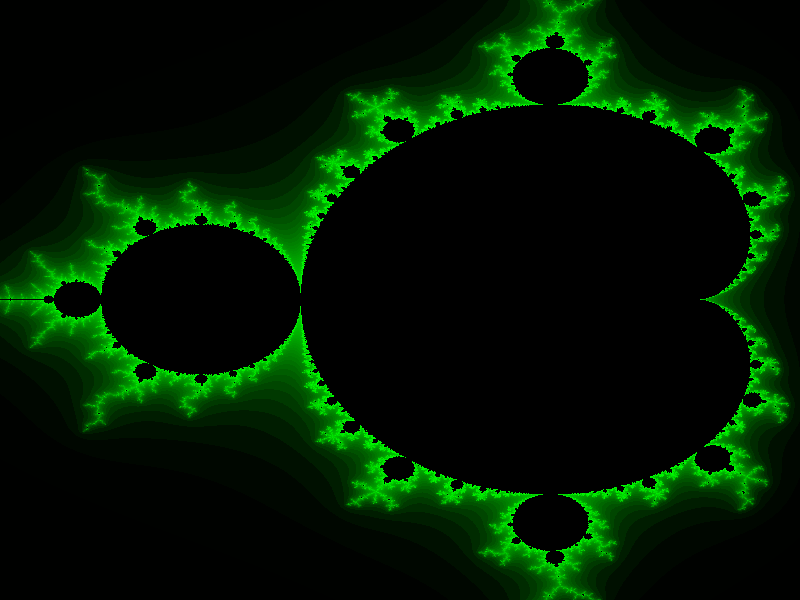

# Mandelbrot Bitmap

Generating a fractal Bitmap with the Mandelbrot-set.

## Note:
Compiling source files with terminal: 
>> $ g++ -std=c++11 main.cpp Bitmap.cpp Mandelbrot.cpp -Wall -o FractalBitmap 
